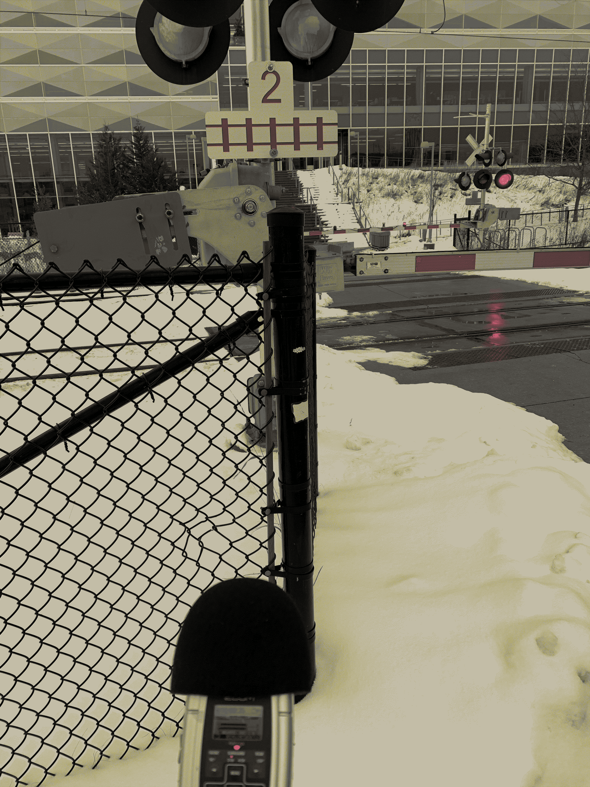

My experience coming into this class was limited to basic use of some audio/music editing software, such as [Audacity](https://www.audacityteam.org/) and [GarageBand](https://www.apple.com/ios/garageband/), so for this lab I was excited to get my feet wet!

**Part 1 - Recording in the Studio**

I visited the lab for the class at Conrad Grebel University College in the afternoon, on a weekend. I was with another student, and we set out to complete our studio recordings one after the other.
Upon entering the lab, it took some time to verify the setup of the large-diaphragm condenser mic (I found it useful to refer to the manual for it: [CAD M179 Microphone](https://www.cadaudio.com/products/equitek/m179#support)).

* *Step 1 - in `cardoid` position, saying my name*
    * The sound of the recording location was quiet; but there was a background hum from the furnace, electrical, etc. systems of the college through the walls, as well as some shuffling from the person who I was sharing the room with.
    * I was worried about not holding myself from an appropriate distance from the microphone; I did not bring a measuring tape or a ruler, so I could not properly verify if my mouth was indeed 15 cm from the microphone. Otherwise, the background noise stayed the same during recording.
    * After recording, I was surprised with how clear my name sounded; however I definitely enunciated my first name more than my last (I think I have a tendency to do that in general).
    * There was a difference in the sounds from Step 1 and Step 2...(which I will get to in the next bit)
* *Step 2 - in `omnidirectional` position, saying my name again*
    * The background ambience stayed the same (as in Step 1); and I believe I heard some muffled foot traffic in the hallway outside the lab before recording.
    * While recording, the background noise was constant (as in the last bullet point).
    * Playing back my recording, I was wondering if I really do '[sound like that](https://www.cnn.com/2021/06/15/health/voice-recording-wellness-partner/index.html)'. Like step 1, the recording was quite clear, but I again enunciated my first name more than my last.
    * Between saying the same thing in `cardoid` and `omnidirectional` patterns with the microphone, I noticed that the recording from Step 2 (`omnidirectional`) sounded more "well-rounded" or "full". I suppose it seems to be this way for me because the `omnidirectional` pattern will pick up sounds from all directions.
* *Step 3 - in `omnidirectional` position, saying a quote*
    * Both the vibes in the lab before and during recording had the same profiles as described in Step 2.
    * After recording and seeing the audio visualized in Ableton, it was really interesting to figure out what words and phrases I made louder or enunciated more than others. I noticed that I also trailed off a bit at the end of speaking the quote.
* *Step 4 - in `omnidirectional` position, "silence"*
    * Before and during recording, someone in an adjacent or nearby music practice room beyond the lab started to play the piano.
    * The microphone picked up the ambience of the room well, including the sounds of the college internals, the shuffling of the person I was with, and even the piano that was playing outside.

**Part 2 - Making Field Recordings**

* *Step 1 - indoors*
    * Later in the same day, after being in the studio, I decided to finish my indoor field recordings. I left the lab to go to the Centre for Environmental and Information Technology (EIT) building, where my undergraduate program (Software Engineering, SE) has a student lounge.
        * My first recording was of someone using a vending machine downstairs in the EIT Cafe.
            * There was nobody else around except for me and the person who I was recording using the machine, so background noise before and during the recording included the hum of the building, the shuffling of the 2 people present, and the drones of the vending machines.
            * Upon hearing the recording, I was surprised to hear how loud the ambient sounds were compared to the sounds from the machine.
                
        * My second recording was of me making Windows OS notification sounds using my keyboard. I thought this might be a second, interesting indoor recording because the speakers on my laptop are a bit "deep-fried", so the notifications sounded a bit distorted.
            * I was sitting in the lounge with a couple other students, so the ambience before and during the recording included some fans of EIT in the background, and students typing.
                

* *Step 2 - outdoors*
    * The next day, I finished my outdoor recordings.
        * My first recording is of the iON railroad crossing bells ringing outside the entrance to E5. There was a lot of background noise, mainly from people walking in the background. I was surprised with how loud the bells turned out to be.
        
        * My second recording happened at the backside of EIT, because there is a lot of humming from the systems of the buildings. There was not much ambience except for this humming, and a few people walking.
        
        * My third recording happened in front of the DC centre, where I recorded the front entrance doors opening and closing. The background noise before and during recording included the doors, and people walking and talking back and forth. 
        
